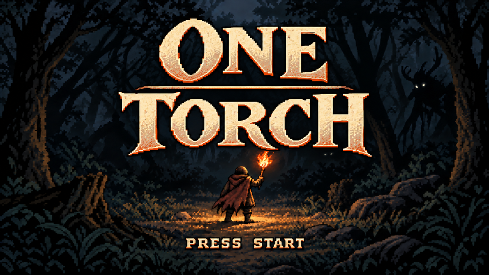
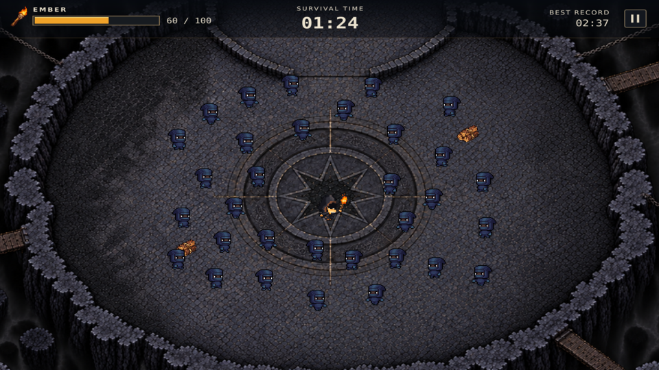
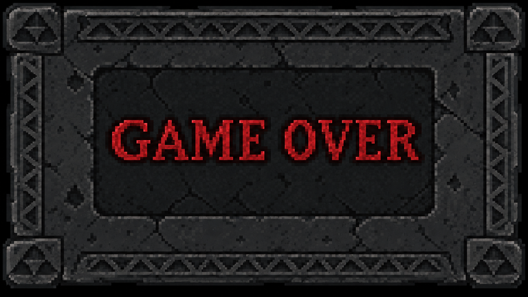

# ONE TORCH — 핵심 게임 기획서

> 어둠 속에서 다가오는 위협을 피해, 단 1초라도 더 살아남아라.

## 1. 게임 개요

| 항목 | 내용 |
| --- | --- |
| 제목 | ONE TORCH |
| 장르 | 2D 탑뷰 생존 회피 게임 |
| 공간 | 장애물 없는 작은 원형 맵, 고정 카메라 |
| 조작 | WASD 또는 방향키로 이동 |
| 목표 | 괴물을 피하며 최대한 오래 생존 |
| 종료 조건 | 괴물과 한 번 접촉하면 종료 |
| 기록 | 생존 시간과 개인 최고 기록 |

## 2. 핵심 재미

**괴물의 이동 방향을 읽고, 빈틈으로 피하는 아슬아슬한 생존.**

여러 방향에서 들어오는 괴물의 경로를 보고 안전한 위치를 판단한다. 가까스로 피하는 긴장감과 자신의 실력으로 최고 기록을 갱신하는 성취감을 제공한다.

## 3. 핵심 규칙

- 플레이어는 맵 안에서 자유롭게 이동하며, 가장자리 밖으로 나갈 수 없다.
- 괴물은 맵 가장자리에서 나타나 **등장 순간의 플레이어 위치를 향해 직선으로 이동**한다.
- 이동을 시작한 괴물은 방향을 바꾸지 않으며, 반대편 맵 밖으로 나가면 사라진다.
- 플레이어는 공격할 수 없다. **이동만으로 괴물을 피해야 한다.**
- 괴물과 접촉하면 횃불이 꺼지고 게임이 끝난다.
- 횃불은 캐릭터 주변을 밝히는 연출로 사용한다. 불씨 게이지와 장작 회복은 제거한다.
- 괴물의 등장 위치와 이동 경로는 어둠 속에서도 알아볼 수 있게 한다.

## 4. 난이도와 플레이 흐름

처음에는 소수의 느린 괴물이 등장한다. 시간이 지날수록 등장 간격이 짧아지고 여러 방향의 경로가 겹치면서 회피가 어려워진다.

**괴물 등장 → 이동 경로 판단 → 빈틈으로 회피 → 생존 시간 증가 → 더 복잡한 위협**

괴물의 속도와 동시 등장 수에는 상한을 두며, 피할 틈이 남도록 조정한다. 제한시간과 최종 클리어는 없다.

## 5. 게임 씬 구성

| 씬 | 내용 |
| --- | --- |
| 시작 | 게임 제목과 이동 조작 표시. 시작 입력 시 플레이로 전환 |
| 플레이 | 괴물을 피하며 생존. 생존 시간과 최고 기록 표시 |
| 끝 | 접촉 시 횃불 소멸 후 GAME OVER. 이번 기록·최고 기록과 재시작 버튼 표시 |

**첫 제작의 검증 목표:** 괴물의 경로를 보고 피할 수 있으며, 실패했을 때 “다음에는 더 오래 버틸 수 있겠다”는 마음이 드는가?

# ONE TORCH — 게임 씬 구성

## 1. 시작
시작 입력을 받으면 플레이 씬으로 이동한다.

## 2. 플레이
횃불로 괴물을 밀쳐내며 생존하고, 장작으로 불씨를 회복한다.

## 3. 끝
불씨 게이지가 0이 되면 GAME OVER 화면으로 전환한다.

